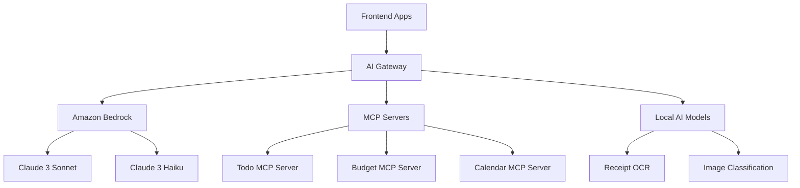

# AI Integration Architecture - HomeManager System

> **AI Development Context** 🤖  
> This document defines the AI integration strategy optimized for development with GitHub Copilot and Claude

## Overview

The HomeManager system leverages AI capabilities to provide intelligent insights, automate routine tasks, and enhance user experience. Our AI integration strategy focuses on practical, value-driven applications that improve family home management.

## AI Architecture Components

### 1. AI Gateway Service


### 2. AI Feature Matrix
```yaml
AI Features:
  Todo Management:
    - Smart task suggestions based on family patterns
    - Automatic task categorization and priority assignment
    - Recurring task optimization recommendations
    - Task delegation suggestions based on family member availability
    
  Budget & Expense:
    - Receipt OCR and automatic expense categorization
    - Spending pattern analysis and anomaly detection
    - Budget optimization recommendations
    - Predictive spending alerts and savings opportunities
    
  Family Coordination:
    - Calendar optimization and conflict resolution
    - Family member workload balancing
    - Seasonal task planning and reminders
    - Communication tone and timing optimization
    
  Insights & Analytics:
    - Family productivity metrics and trends
    - Cost-saving opportunity identification
    - Workflow efficiency recommendations
    - Personalized improvement suggestions
```

## Implementation Strategy

### Phase 1: Foundation (Weeks 1-2)
```yaml
Objectives:
  - Establish AI Gateway service architecture
  - Integrate Amazon Bedrock with Claude models
  - Implement basic MCP server framework
  - Set up development environment for AI features

Deliverables:
  - AI Gateway service with basic routing
  - Claude 3 Sonnet integration for complex reasoning
  - Claude 3 Haiku integration for fast responses
  - MCP server templates and development tools
```

### Phase 2: Core AI Features (Weeks 3-4)
```yaml
Objectives:
  - Implement receipt OCR and expense categorization
  - Build todo suggestion and optimization engine
  - Create family pattern analysis capabilities
  - Develop AI-powered insights dashboard

Deliverables:
  - Receipt processing with 95%+ accuracy
  - Smart todo suggestions with confidence scoring
  - Basic family pattern recognition
  - AI insights API endpoints
```

### Phase 3: Advanced Intelligence (Weeks 5-6)
```yaml
Objectives:
  - Implement predictive analytics and forecasting
  - Build personalized recommendation engine
  - Create conversational AI interface
  - Optimize AI performance and cost efficiency

Deliverables:
  - Predictive budget and task analytics
  - Personalized family recommendations
  - AI chat interface for family assistance
  - Performance optimization and cost monitoring
```

## Technical Architecture

### AI Gateway Service
```csharp
// AI Gateway Service Structure
namespace HomeManager.AI.Gateway;

/// <summary>
/// Central AI service coordinator for HomeManager system.
/// Routes AI requests to appropriate models and MCP servers.
/// 
/// AI Context: This service orchestrates:
/// - Amazon Bedrock model invocations
/// - MCP server communications
/// - Local AI model inference
/// - Response aggregation and optimization
/// </summary>
public interface IAIGatewayService
{
    /// <summary>
    /// Generate intelligent todo suggestions for a family.
    /// </summary>
    Task<TodoSuggestionResponse> GenerateTodoSuggestionsAsync(
        TodoSuggestionRequest request,
        CancellationToken cancellationToken = default);
        
    /// <summary>
    /// Analyze receipt image and extract expense information.
    /// </summary>
    Task<ReceiptAnalysisResponse> AnalyzeReceiptAsync(
        ReceiptAnalysisRequest request,
        CancellationToken cancellationToken = default);
        
    /// <summary>
    /// Generate family insights and recommendations.
    /// </summary>
    Task<FamilyInsightsResponse> GenerateInsightsAsync(
        FamilyInsightsRequest request,
        CancellationToken cancellationToken = default);
}
```

### MCP Server Integration
```typescript
// MCP Server Framework
interface MCPServer {
  name: string;
  capabilities: string[];
  endpoint: string;
  authentication: MCPAuthConfig;
}

// Todo MCP Server
class TodoMCPServer implements MCPServer {
  name = 'todo-intelligence';
  capabilities = [
    'task-suggestion',
    'priority-optimization',
    'pattern-analysis',
    'delegation-recommendation'
  ];
  
  async suggestTasks(context: FamilyContext): Promise<TaskSuggestion[]> {
    // AI-powered task suggestion logic
  }
  
  async optimizePriorities(tasks: Task[]): Promise<OptimizedTaskList> {
    // Priority optimization based on family patterns
  }
}
```

### Amazon Bedrock Integration
```csharp
// Bedrock Service Configuration
public class BedrockConfiguration
{
    public string Region { get; set; } = "us-east-1";
    public string DefaultModel { get; set; } = "anthropic.claude-3-sonnet-20240229-v1:0";
    public string FastModel { get; set; } = "anthropic.claude-3-haiku-20240307-v1:0";
    public int MaxTokens { get; set; } = 4096;
    public double Temperature { get; set; } = 0.1;
    public TimeSpan Timeout { get; set; } = TimeSpan.FromSeconds(30);
}

// Bedrock Service Implementation
public class BedrockService : IBedrockService
{
    public async Task<AIResponse> InvokeModelAsync(
        AIRequest request,
        string modelId = null,
        CancellationToken cancellationToken = default)
    {
        // Amazon Bedrock model invocation logic
        // Includes prompt optimization and response processing
    }
}
```

## AI Development Guidelines

### Prompt Engineering Standards
```yaml
Prompt Structure:
  Context: |
    You are an AI assistant for HomeManager, a family home management system.
    Your role is to help families organize tasks, manage budgets, and coordinate activities.
    
  System Information: |
    Technology Stack: .NET 10, React, AWS
    Database: PostgreSQL + DynamoDB + DocumentDB
    User Context: Family with {member_count} members
    
  Task-Specific Context: |
    Current Task: {task_description}
    Family Patterns: {family_patterns}
    Available Data: {data_summary}
    
  Output Requirements: |
    Format: JSON with confidence scores
    Language: Clear, family-friendly
    Actionability: Include specific next steps
```

### Model Selection Strategy
```yaml
Claude 3 Sonnet (Complex Reasoning):
  Use Cases:
    - Family pattern analysis and insights
    - Complex budget optimization recommendations
    - Multi-step task planning and coordination
    - Detailed financial analysis and forecasting
  
  Characteristics:
    - Higher accuracy for complex reasoning
    - Better context understanding
    - More detailed and nuanced responses
    - Higher cost per token

Claude 3 Haiku (Fast Responses):
  Use Cases:
    - Quick todo suggestions
    - Simple expense categorization
    - Real-time chat responses
    - Basic data extraction and processing
  
  Characteristics:
    - Faster response times
    - Lower cost per token
    - Good for straightforward tasks
    - Optimized for efficiency
```

### Performance and Cost Optimization
```yaml
Optimization Strategies:
  Request Batching:
    - Combine multiple small requests
    - Reduce API call overhead
    - Implement intelligent request queuing
    
  Response Caching:
    - Cache similar requests for 1-24 hours
    - Implement cache invalidation strategies
    - Use Redis for fast cache access
    
  Model Routing:
    - Route simple requests to Haiku
    - Use Sonnet for complex analysis
    - Implement fallback mechanisms
    
  Context Optimization:
    - Minimize unnecessary context in prompts
    - Use structured data formats
    - Implement prompt compression techniques
```

## Security and Privacy

### Data Protection
```yaml
Privacy Measures:
  Data Minimization:
    - Only send necessary data to AI models
    - Implement data anonymization where possible
    - Use family IDs instead of personal identifiers
    
  Encryption:
    - Encrypt all AI API communications
    - Use AWS KMS for key management
    - Implement end-to-end encryption for sensitive data
    
  Access Control:
    - Family-isolated AI processing
    - Role-based access to AI features
    - Audit logging for all AI interactions
```

### Compliance and Ethics
```yaml
Ethical AI Guidelines:
  Transparency:
    - Clearly indicate AI-generated content
    - Provide confidence scores for recommendations
    - Allow users to understand AI decision-making
    
  Fairness:
    - Avoid bias in family member recommendations
    - Ensure equal access to AI features
    - Regular bias testing and mitigation
    
  User Control:
    - Allow users to disable AI features
    - Provide manual override for AI decisions
    - Respect user preferences and feedback
```

## Monitoring and Analytics

### AI Performance Metrics
```yaml
Key Metrics:
  Accuracy:
    - Receipt OCR accuracy rate (target: 95%+)
    - Expense categorization accuracy (target: 90%+)
    - Todo suggestion relevance score (target: 85%+)
    
  Performance:
    - Average response time (target: <2 seconds)
    - Model availability (target: 99.9%)
    - Error rate (target: <1%)
    
  Cost Efficiency:
    - Cost per AI interaction
    - Token usage optimization
    - ROI on AI features
    
  User Satisfaction:
    - AI feature adoption rate
    - User feedback scores
    - Feature usage frequency
```

### Continuous Improvement
```yaml
Improvement Process:
  Data Collection:
    - User interaction analytics
    - AI response quality feedback
    - Error pattern analysis
    
  Model Fine-tuning:
    - Regular model performance evaluation
    - Custom model training with family data
    - A/B testing for prompt optimization
    
  Feature Evolution:
    - User feedback integration
    - New AI capability assessment
    - Competitive analysis and benchmarking
```

## Future Roadmap

### Short-term (3-6 months)
- Implement core AI features for todos and budgets
- Optimize model performance and cost efficiency
- Launch AI-powered insights dashboard
- Establish performance baselines and monitoring

### Medium-term (6-12 months)
- Add conversational AI interface
- Implement predictive analytics and forecasting
- Develop personalized recommendation engine
- Integrate with external AI services and APIs

### Long-term (12+ months)
- Custom model training with HomeManager data
- Advanced family behavior modeling
- Integration with IoT devices and smart home systems
- Multi-modal AI capabilities (voice, image, text)