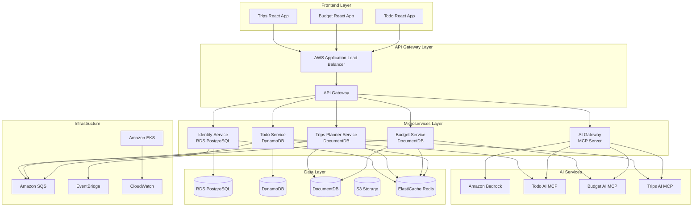
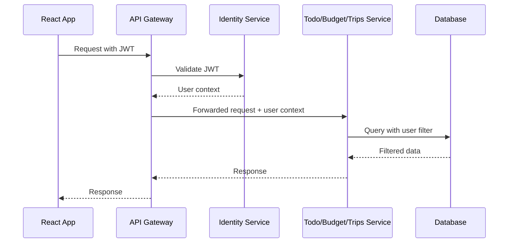

# System Architecture Overview

> **AI-Friendly Documentation** 🤖  
> Structured for optimal GitHub Copilot, Claude Sonnet, and GPT model consumption

## 🏗️ **High-Level Architecture**



## 🎯 **Architecture Principles**

### **1. Microservices Design Patterns**

#### **Service Autonomy**
```yaml
Each service owns:
  - Its data store
  - Business logic
  - API contract
  - Deployment lifecycle
  - Scaling decisions
```

#### **Database per Service**
```yaml
Identity Service: RDS PostgreSQL
  - ACID transactions for user security
  - Relational data (users, roles, families)
  - Mature identity framework support

Todo Service: DynamoDB
  - NoSQL flexibility for task schemas
  - Fast reads/writes for task operations
  - Global secondary indexes for queries

Budget Service: DocumentDB (MongoDB)
  - Document storage for complex receipts
  - Flexible schema for financial data
  - Aggregation pipeline for reports

Trips Planner Service: DocumentDB (MongoDB)
  - Document storage for trip itineraries
  - Flexible schema for travel data
  - Geospatial queries for location features
  - Aggregation pipeline for travel analytics
```

#### **Communication Patterns**
```yaml
Synchronous: HTTP/REST for request-response
Asynchronous: SQS + EventBridge for events
AI Integration: MCP protocol for AI services
```

### **2. AI-First Architecture**

#### **MCP Server Integration**
```typescript
// Model Context Protocol servers provide AI tools
interface MCPServer {
  name: string;
  version: string;
  tools: MCPTool[];
}

interface MCPTool {
  name: string;
  description: string;
  inputSchema: JSONSchema;
  handler: (input: any) => Promise<any>;
}
```

#### **AI Service Layers**
```yaml
AI Gateway:
  - MCP server coordinator
  - Cross-service AI operations
  - Context aggregation

Service-Specific AI:
  - Todo AI: Task intelligence
  - Budget AI: Financial insights
  - Trips AI: Travel planning and suggestions

Foundation Models:
  - Amazon Bedrock
  - Claude Sonnet integration
  - GPT model support
```

### **3. Cloud-Native Patterns**

#### **Container Strategy**
```dockerfile
# Multi-stage builds for optimization
FROM mcr.microsoft.com/dotnet/aspnet:10.0 AS base
FROM mcr.microsoft.com/dotnet/sdk:10.0 AS build
# Service-specific optimizations
```

#### **Kubernetes Deployment**
```yaml
# Each service gets:
apiVersion: apps/v1
kind: Deployment
metadata:
  name: todo-service
spec:
  replicas: 3
  strategy:
    type: RollingUpdate
    rollingUpdate:
      maxSurge: 1
      maxUnavailable: 0
```

## 📊 **Data Architecture**

### **Polyglot Persistence Strategy**

#### **SQL for Strong Consistency**
```sql
-- Identity Service: RDS PostgreSQL
CREATE TABLE users (
    id UUID PRIMARY KEY,
    email VARCHAR(255) UNIQUE NOT NULL,
    password_hash VARCHAR(255) NOT NULL,
    family_id UUID,
    created_at TIMESTAMP DEFAULT NOW()
);

CREATE TABLE families (
    id UUID PRIMARY KEY,
    name VARCHAR(255) NOT NULL,
    created_at TIMESTAMP DEFAULT NOW()
);
```

#### **NoSQL for Flexibility**
```json
// Todo Service: DynamoDB
{
  "PK": "USER#123",              // Partition Key
  "SK": "TODO#456",              // Sort Key
  "GSI1PK": "FAMILY#789",        // Family queries
  "GSI1SK": "2024-10-03",        // Due date queries
  "title": "Fix leaky faucet",
  "status": "pending",
  "priority": "high",
  "tags": ["plumbing", "urgent"],
  "ai_suggestions": {
    "estimated_duration": 60,
    "required_tools": ["wrench", "plumber_tape"],
    "difficulty": "medium"
  }
}
```

```json
// Budget Service: DocumentDB (MongoDB)
{
  "_id": "expense_123",
  "user_id": "USER#123",
  "family_id": "FAMILY#789",
  "amount": 45.99,
  "category": {
    "primary": "groceries",
    "subcategory": "weekly_shopping",
    "ai_detected": true
  },
  "receipt": {
    "store": "Whole Foods",
    "items": [
      {"name": "Milk", "price": 4.99, "category": "dairy"},
      {"name": "Bread", "price": 3.50, "category": "bakery"}
    ],
    "payment_method": "credit_card",
    "ai_processed": true
  },
  "location": {
    "coordinates": [40.7128, -74.0060],
    "address": "123 Main St, NY"
  },
  "ai_insights": {
    "spending_pattern": "normal",
    "budget_impact": "low",
    "suggestions": ["Consider bulk buying for milk"]
  }
}
```

```json
// Trips Planner Service: DocumentDB (MongoDB)
{
  "_id": "trip_123",
  "tripId": "TRIP#456",
  "familyId": "FAMILY#789",
  "title": "Summer Family Vacation",
  "destination": {
    "city": "Orlando",
    "country": "USA",
    "coordinates": {
      "latitude": 28.5383,
      "longitude": -81.3792
    },
    "timezone": "America/New_York"
  },
  "startDate": "2024-07-15",
  "endDate": "2024-07-22",
  "status": "confirmed",
  "budget": {
    "totalBudget": 5000.00,
    "currency": "USD",
    "categoryBudgets": {
      "accommodation": 2000.00,
      "transportation": 800.00,
      "food": 1200.00,
      "activities": 1000.00
    }
  },
  "participants": [
    {
      "userId": "USER#123",
      "role": "organizer",
      "joinedAt": "2024-06-01T10:00:00Z"
    }
  ],
  "aiSuggestions": {
    "recommendedActivities": [
      {
        "name": "Disney World Magic Kingdom",
        "estimatedCost": 109.00,
        "rating": 4.8,
        "category": "theme_park"
      }
    ],
    "budgetOptimization": {
      "potentialSavings": 300.00,
      "suggestions": ["Book accommodation 2 weeks earlier for 15% discount"]
    }
  }
}
```

## 🔄 **Service Communication**

### **Synchronous Communication**
```csharp
// Service-to-service HTTP calls with resilience
public class TodoController : ControllerBase
{
    private readonly IHttpClientFactory _httpClient;
    private readonly ILogger<TodoController> _logger;
    
    [HttpGet("/api/todos")]
    public async Task<IActionResult> GetTodos([FromQuery] string userId)
    {
        using var activity = TodoTelemetry.ActivitySource.StartActivity("GetTodos");
        activity?.SetTag("user.id", userId);
        
        // Validate user via Identity service
        var user = await _identityClient.ValidateUserAsync(userId);
        if (user == null) return Unauthorized();
        
        // Get todos from DynamoDB
        var todos = await _todoService.GetUserTodosAsync(userId);
        
        // Enrich with AI suggestions if requested
        if (Request.Headers.ContainsKey("X-Include-AI"))
        {
            todos = await _aiService.EnrichTodosWithSuggestionsAsync(todos);
        }
        
        return Ok(todos);
    }
}
```

### **Asynchronous Communication**
```csharp
// Event-driven communication
public class BudgetService
{
    private readonly IEventPublisher _eventPublisher;
    
    public async Task CreateExpenseAsync(CreateExpenseRequest request)
    {
        var expense = await _repository.CreateExpenseAsync(request);
        
        // Publish event for other services
        await _eventPublisher.PublishAsync(new ExpenseCreatedEvent
        {
            ExpenseId = expense.Id,
            UserId = expense.UserId,
            Amount = expense.Amount,
            Category = expense.Category,
            Timestamp = DateTime.UtcNow
        });
        
        // AI processing can happen asynchronously
        _ = Task.Run(async () => 
        {
            await _aiService.AnalyzeSpendingPatternAsync(expense);
        });
    }
}
```

### **AI Service Communication**
```csharp
// MCP server integration
public class AIGatewayService
{
    private readonly IMCPServerClient _mcpClient;
    
    public async Task<AIResponse> ProcessNaturalLanguageAsync(string input, string context)
    {
        // Route to appropriate MCP server based on context
        var server = context switch
        {
            "todo" => "todo-ai-mcp",
            "budget" => "budget-ai-mcp",
            _ => "general-ai-mcp"
        };
        
        return await _mcpClient.InvokeToolAsync(server, "process_natural_language", new
        {
            input = input,
            context = context,
            user_preferences = await GetUserPreferencesAsync()
        });
    }
}
```

## 📈 **Scalability Patterns**

### **Horizontal Scaling**
```yaml
# Kubernetes HPA configuration
apiVersion: autoscaling/v2
kind: HorizontalPodAutoscaler
metadata:
  name: todo-service-hpa
spec:
  scaleTargetRef:
    apiVersion: apps/v1
    kind: Deployment
    name: todo-service
  minReplicas: 2
  maxReplicas: 10
  metrics:
  - type: Resource
    resource:
      name: cpu
      target:
        type: Utilization
        averageUtilization: 70
```

### **Database Scaling**
```yaml
DynamoDB:
  - On-demand scaling
  - Global secondary indexes
  - DynamoDB Accelerator (DAX) for caching

DocumentDB:
  - Read replicas for read scaling
  - Connection pooling
  - Sharding for write scaling

RDS PostgreSQL:
  - Read replicas
  - Connection pooling
  - Vertical scaling for writes
```

## 🔒 **Security Architecture**

### **Authentication Flow**


### **Security Layers**
```yaml
Network Security:
  - VPC with private subnets
  - Security groups
  - NACLs

Application Security:
  - JWT authentication
  - HTTPS everywhere
  - Input validation
  - SQL injection prevention

Data Security:
  - Encryption at rest
  - Encryption in transit
  - IAM roles and policies
  - Secrets management
```

## 📊 **Monitoring & Observability**

### **Three Pillars of Observability**
```yaml
Metrics:
  - Business metrics (todos created, expenses tracked)
  - Technical metrics (response times, error rates)
  - Infrastructure metrics (CPU, memory, disk)

Logs:
  - Structured logging with correlation IDs
  - Centralized log aggregation
  - Log-based alerts

Traces:
  - Distributed tracing across services
  - Request flow visualization
  - Performance bottleneck identification
```

### **Monitoring Stack**
```yaml
Collection: OpenTelemetry
Storage: CloudWatch + Prometheus
Visualization: Grafana + CloudWatch Dashboards
Alerting: CloudWatch Alarms + PagerDuty
```

---

## 🎯 **AI Development Context**

**For GitHub Copilot/Claude/GPT:**

This architecture follows microservices patterns with:
- **Service autonomy**: Each service is independently deployable
- **Polyglot persistence**: Different databases for different needs
- **AI-first design**: MCP servers for AI integration
- **Cloud-native**: Designed for AWS with Kubernetes
- **Event-driven**: Asynchronous communication where appropriate
- **Observable**: Built-in monitoring and tracing

When implementing services, follow these patterns:
1. **Controller** → **Service** → **Repository** → **Database**
2. **AI enrichment** via MCP server integration
3. **Event publishing** for cross-service communication
4. **Telemetry** for observability
5. **Health checks** for Kubernetes readiness